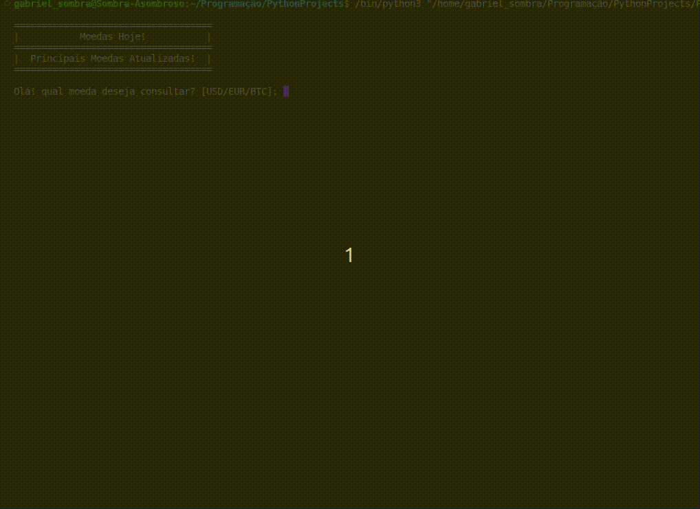

# App de Cotações Atualizadas

## 1. Sobre / About

Esse é um App de console que desenvolvi usando as Bibliotecas `Requests` e `JSON` do Python na sua versão 3.10.

Ele exibe as cotações atualizadas em tempo real de três Moedas: **Dolár**, **Euro** e **Bitcoin**, você pode realizar várias consultas aos preços e no final o programa te mostrará quantas consultas o usuário realizou!

## 2. Prévia / Preview

## 3. ✍️ Autor / Author

- [@GabrielSombra2234](https://github.com/GabrielSombra2234) - Idea & Initial work